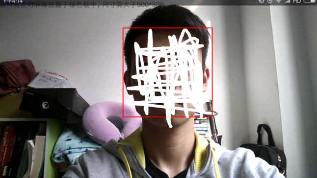
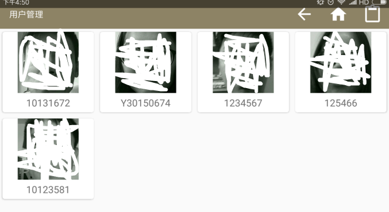

# FaceAccessControl
本科毕业设计，基于Android的人脸门禁系统  
传统的门禁系统以钥匙作为验证手段，便捷程度低，丢失钥匙之后会导致极大的安全问题。人脸是一种极易获得的生物特征，具有唯一性、稳定性的特点，并且使用时设备无需与人脸接触，因此可以作为新一代的门禁验证手段。近年来，随着Android移动设备性能的不断提升，使得在移动设备上进行人脸识别成为可能。本repo设计并开发了一个基于Android平台的人脸识别门禁系统，并解决了在实际运用中可能遇到的光照变化，人脸姿态变化等情况。主要内容如下：
（1）基于双眼检测的正脸判断算法研究。人脸识别中，人脸的姿态变化会导致识别率降低。首先研究实现了基于Haar特征的Adaboost人脸检测算法，检测定位出人脸的框架和双眼的位置。然后通过人脸与双眼的位置关系，提出了一个正脸判断的方法。实验表明，该方法有效地降低了人脸姿态问题对于整个识别系统的影响。
（2）基于LBP+PCA的人脸识别算法研究。首先分析了局部二值模式LBP和主成份分析PCA的原理，研究了LBP与PCA相结合的特征提取方法。相对于单独使用PCA方法，该组合方法能够有效地降低光照变化对人脸识别准确度的影响。然后，采用支持向量机对特征进行分类，并利用置信度计算方法，来有效地表示人脸和分类结果的隶属程度。实验表明，该算法对于光照变化情况下的人脸识别，准确率有了明显的提升。
（3）Android平台上人脸识别门禁系统的设计与实现。分析了系统的需求，设计了具有用户注册、人脸检测与识别、门禁开关、管理员模块、通知模块等功能模块的人脸识别门禁系统。然后在Android平台上，利用Java语言和计算机图像视觉库Opencv，按照软件工程逻辑完成了系统的整体开发。整个系统经过测试运行，能够满足典型环境中的使用需求。  

# 部分系统界面
用户主界面：  

识别界面：  

识别成功页面：  

用户管理页面：  
  
